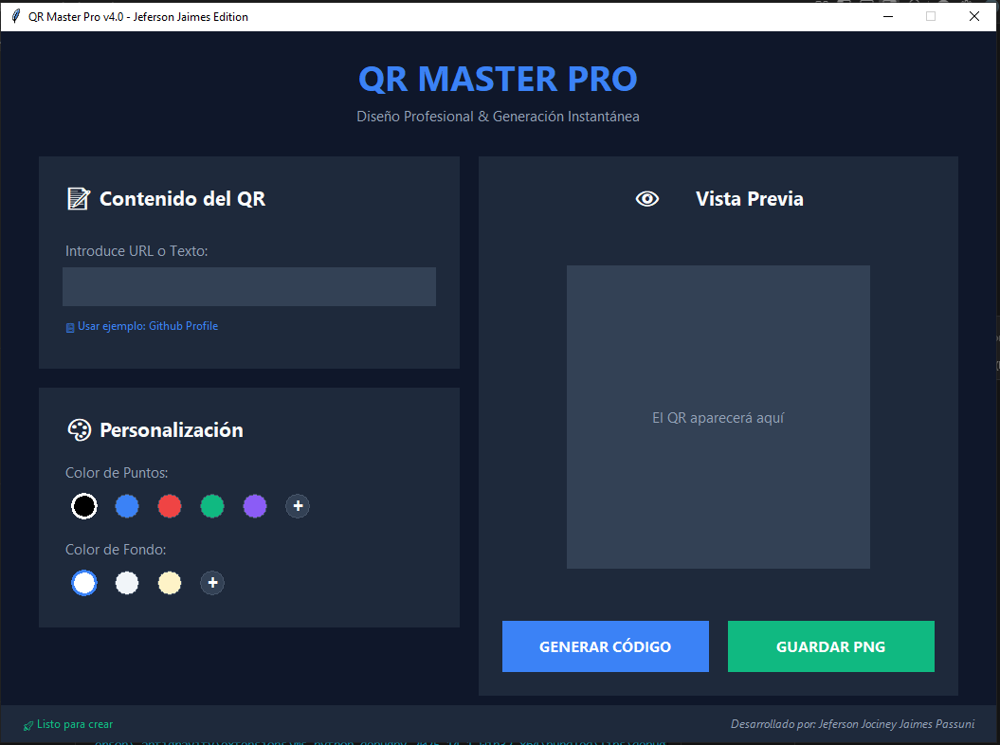
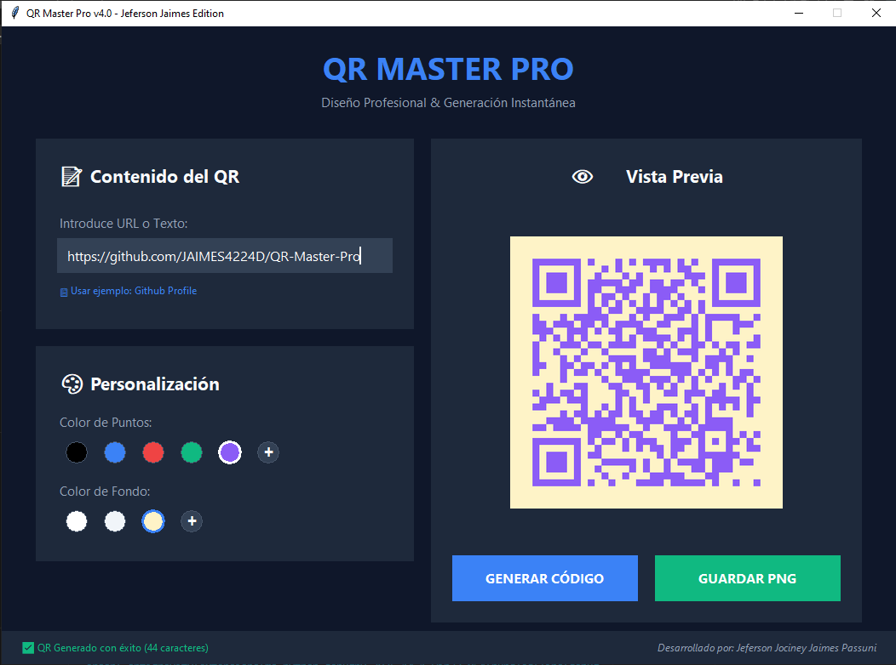
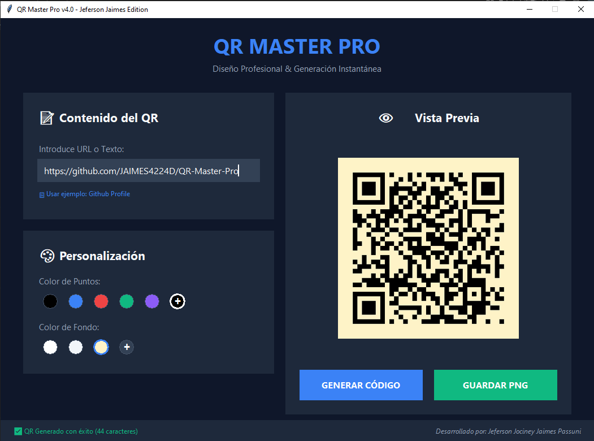

# 🔷 QR Master Pro — Edición Jeferson Jaimes

<p align="center">
  
</p>

<p align="center">
  <a href="https://github.com/JAIMES4224D/QR-Master-Pro/blob/main/LICENSE"></a>
  <a href="https://www.python.org/"></a>
  <a href="https://github.com/JAIMES4224D"></a>
  
  <a href="https://github.com/JAIMES4224D/QR-Master-Pro/stargazers"></a>
</p>

<p align="center">
  <strong style="font-size:1.05rem;">Generador de códigos QR elegante, personalizable y con vista previa en tiempo real — pensado para diseñadores, marcas y desarrolladores.</strong>
</p>

---

## 📑 Índice
1. [✨ Demo Rápida](#-demo-rápida)
2. [🚀 Características](#-características-principales)
3. [🔧 Instalación](#-instalación-rápida)
4. [⚡ Uso Rápido](#-uso-rápido)
5. [🎨 Personalización Avanzada](#-personalización-avanzada)
6. [📱 Formatos Soportados](#-formatos-soportados)
7. [🖼️ Galería](#-galería)
8. [🖨️ Exportación & Impresión](#-exportación--calidad-de-impresión)
9. [🤝 Contribuir](#-contribuir)
10. [❓ Preguntas Frecuentes](#-preguntas-frecuentes)
11. [⚖️ Licencia](#-licencia)
12. [✉️ Contacto](#-contacto)

---

## ✨ Demo Rápida

> Interfaz moderna con modo oscuro, selector HEX y vista previa en vivo.

<p align="center">
  <!-- Reemplazar con GIF real cuando esté disponible -->
  
</p>

---

## 🚀 Características principales

### 🎯 **Funcionalidades Básicas**
- ✅ Generación de QR a partir de URLs, texto, vCard, Wi-Fi credentials
- ✅ Vista previa en tiempo real con actualización instantánea
- ✅ Interfaz gráfica moderna con tema oscuro por defecto
- ✅ Compatibilidad con Windows, macOS y Linux

### 🎨 **Personalización Visual**
- 🎨 Selector de color HEX para módulos y fondo
- 🖼️ Inserción de logo/imagen central con ajuste automático
- 📏 Control de tamaño (100px a 3000px)
- 🔲 Ajuste de márgenes (0px a 50px)
- 🛡️ Niveles de corrección de errores (L/M/Q/H)

### 📤 **Exportación Profesional**
- 🖼️ Exportación PNG en alta resolución
- 📊 Configuración de DPI para impresión profesional
- 🎯 Área segura para logos (recomendación automática)
- 📁 Nombrado inteligente de archivos

### 🔧 **Herramientas Adicionales**
- 💾 Plantillas predefinidas (Corporate, Minimal, Creative)
- 🎯 Validación de contraste para accesibilidad
- 📱 Simulador de escaneo en dispositivos móviles
- 📊 Estadísticas de densidad y legibilidad

---

## 🔧 Instalación Rápida

### Requisitos Previos
- **Python 3.8** o superior
- **pip** actualizado

### Método 1: Instalación Estándar

```bash
# 1. Clonar el repositorio
git clone https://github.com/JAIMES4224D/QR-Master-Pro.git
cd QR-Master-Pro

# 2. Crear entorno virtual (recomendado)
python -m venv venv

# 3. Activar entorno virtual
# Windows:
venv\Scripts\activate
# Linux/Mac:
source venv/bin/activate

# 4. Instalar dependencias
pip install -r requirements.txt
```

### Método 2: Instalación Rápida

```bash
# Instalar dependencias directamente
pip install qrcode[pil] pillow tkinterdnd2
```

### Verificar Instalación

```bash
# Ejecutar la aplicación
python QR_Master_Pro_Design.py
```

---

## ⚡ Uso Rápido

### Interfaz Gráfica (GUI)
1. **Iniciar aplicación**: `python QR_Master_Pro_Design.py`
2. **Ingresar contenido**: URL, texto o datos estructurados
3. **Personalizar diseño**: Usar controles deslizantes y selectores
4. **Vista previa**: Ver cambios en tiempo real
5. **Exportar**: Guardar en formato PNG con calidad configurable

### Línea de Comandos (CLI)

```bash
# Ejemplo básico
python QR_Master_Pro_Design.py --text "https://github.com/JAIMES4224D" --output mi_qr.png

# Ejemplo avanzado con personalización
python QR_Master_Pro_Design.py \
  --text "Hola Mundo" \
  --size 1200 \
  --background "#0f1724" \
  --foreground "#00b4d8" \
  --margin 12 \
  --error-correction H \
  --logo mi_logo.png \
  --logo-size 20 \
  --dpi 300 \
  --output "qr_profesional.png"
```

### Parámetros CLI Completos

| Parámetro | Descripción | Valores |
|-----------|-------------|---------|
| `--text` | Contenido del QR | Texto o URL |
| `--size` | Tamaño en píxeles | 100-3000 |
| `--background` | Color de fondo | HEX (#RRGGBB) |
| `--foreground` | Color de módulos | HEX (#RRGGBB) |
| `--margin` | Margen en píxeles | 0-50 |
| `--error-correction` | Nivel de corrección | L, M, Q, H |
| `--logo` | Ruta al logo | archivo PNG/JPG |
| `--logo-size` | Tamaño del logo (%) | 10-30 |
| `--dpi` | Resolución para impresión | 72-600 |
| `--output` | Archivo de salida | nombre.png |

---

## 🎨 Personalización Avanzada

### Paleta de Colores Predefinida

<p align="center">
  
  
  
  
  
</p>

### Combinaciones Recomendadas

```python
# Ejemplos de combinaciones profesionales
plantillas = {
    "corporate": {
        "bg": "#0f1724",
        "fg": "#00b4d8",
        "margin": 8,
        "error": "H"
    },
    "minimal": {
        "bg": "#ffffff",
        "fg": "#000000",
        "margin": 4,
        "error": "M"
    },
    "creative": {
        "bg": "#f8fafc",
        "fg": "#ec4899",
        "margin": 12,
        "error": "Q"
    }
}
```

### Mejores Prácticas para Logos

```yaml
recomendaciones_logo:
  tamaño_máximo: "20% del área total"
  formato_recomendado: "PNG con transparencia"
  corrección_errores: "Usar nivel H con logo"
  área_segura: "Mantener zona silenciosa de 4 módulos"
  contraste: "Mínimo 4.5:1 para accesibilidad"
```

### Códigos de Corrección de Error

| Nivel | Capacidad de Recuperación | Uso Recomendado |
|-------|--------------------------|-----------------|
| **L** | ~7% | Texto simple, sin logo |
| **M** | ~15% | Uso general, QR pequeños |
| **Q** | ~25% | QR con logo, impresión |
| **H** | ~30% | QR con logo grande, aplicaciones críticas |

---

## 📱 Formatos Soportados

### Tipos de Contenido
- **URLs**: `https://ejemplo.com`
- **Texto Simple**: Mensajes, información de contacto
- **vCard 3.0/4.0**: Tarjetas de contacto completas
- **Credenciales Wi-Fi**: `WIFI:S:SSID;T:WPA;P:password;;`
- **Correos Electrónicos**: `mailto:ejemplo@email.com`
- **SMS**: `smsto:+1234567890:mensaje`
- **Ubicación**: Coordenadas geográficas
- **Eventos**: Calendario y recordatorios

### Estructura vCard Ejemplo

```text
BEGIN:VCARD
VERSION:3.0
N:Jaimes;Jeferson;;;
FN:Jeferson Jaimes
ORG:QR Master Pro;
TITLE:Desarrollador
TEL:+1234567890
EMAIL:jeferson@ejemplo.com
URL:https://github.com/JAIMES4224D
END:VCARD
```

---

## 🖼️ Galería

<p align="center">
  
  
  
  
</p>

---

## 🖨️ Exportación & Calidad de Impresión

### Configuraciones Recomendadas

| Uso | Tamaño | DPI | Formato | Margen |
|-----|--------|-----|---------|--------|
| **Web/Redes Sociales** | 500px | 72 | PNG | 8px |
| **Documentos Digitales** | 1000px | 150 | PNG | 12px |
| **Impresión Estándar** | 2000px | 300 | PNG | 16px |
| **Impresión Profesional** | 3000px | 600 | PNG/PDF | 20px |

### Guía de Preparación para Impresión

```yaml
preparación_impresión:
  paso_1: "Exportar a tamaño mínimo 2000px"
  paso_2: "Configurar DPI a 300 o superior"
  paso_3: "Verificar área silenciosa (margen)"
  paso_4: "Probar escaneo en múltiples dispositivos"
  paso_5: "Realizar prueba de impresión en escala de grises"
```

### Validación de Calidad

```bash
# Verificar legibilidad del QR generado
python -c "
import qrcode
from PIL import Image

qr = qrcode.QRCode(version=1, error_correction=qrcode.constants.ERROR_CORRECT_H)
qr.add_data('https://ejemplo.com')
qr.make(fit=True)

img = qr.make_image(fill_color='black', back_color='white')
print(f'Tamaño: {img.size}')
print(f'Modo: {img.mode}')
print(f'DPI: {img.info.get(\"dpi\", \"No especificado\")}')
"
```

---

## 🤝 Contribuir

¡Tu ayuda es bienvenida! Sigue estos pasos:

### 1. Flujo de Contribución

```bash
# 1. Fork del repositorio
# 2. Clonar tu fork
git clone https://github.com/tu-usuario/QR-Master-Pro.git

# 3. Crear rama de feature
git checkout -b feature/nueva-funcionalidad

# 4. Hacer cambios y commit
git add .
git commit -m "feat: añadir nueva funcionalidad"

# 5. Push a tu fork
git push origin feature/nueva-funcionalidad

# 6. Crear Pull Request
```

### 2. Estándares de Código

```python
"""
Ejemplo de documentación de función según estándares
"""

def generar_qr_avanzado(
    contenido: str,
    tamaño: int = 1000,
    color_fondo: str = "#ffffff",
    color_modulos: str = "#000000",
    margen: int = 10,
    nivel_error: str = "H"
) -> Image:
    """
    Genera un código QR personalizado.
    
    Args:
        contenido (str): Texto o URL a codificar
        tamaño (int): Tamaño en píxeles (100-3000)
        color_fondo (str): Color de fondo en HEX
        color_modulos (str): Color de módulos en HEX
        margen (int): Margen en píxeles (0-50)
        nivel_error (str): Nivel de corrección (L/M/Q/H)
    
    Returns:
        PIL.Image: Imagen del QR generado
    
    Raises:
        ValueError: Si los parámetros son inválidos
    """
    # Implementación aquí
    pass
```

### 3. Áreas de Mejora Priorizadas

- [ ] **Exportación a SVG/PDF**
- [ ] **Interfaz web con FastAPI/Streamlit**
- [ ] **Generación por lotes (batch processing)**
- [ ] **API REST para integraciones**
- [ ] **Plantillas predefinidas avanzadas**
- [ ] **Análisis de legibilidad y escaneo**
- [ ] **Soporte para códigos de barras 2D adicionales**
- [ ] **Integración con servicios en la nube**

### 4. Directrices para Issues

```markdown
## Tipo de Issue
- [ ] Bug
- [ ] Mejora
- [ ] Nueva característica
- [ ] Documentación

## Descripción
[Describe claramente el problema o sugerencia]

## Pasos para reproducir
1. [Paso 1]
2. [Paso 2]
3. [Paso 3]

## Comportamiento esperado
[Qué debería suceder]

## Comportamiento actual
[Qué sucede actualmente]

## Screenshots/Logs
[Añadir capturas si aplica]

## Ambiente
- OS: [Windows/Linux/macOS]
- Python: [versión]
- App: [versión]
```

---

## ❓ Preguntas Frecuentes

### Preguntas Técnicas

**Q: ¿Puedo incrustar un logo grande en el QR?**  
R: Sí, pero recomiendo:
- Usar nivel de corrección H
- Limitar logo al 20% del área total
- Mantener área silenciosa de 4 módulos
- Probar con múltiples escáneres

**Q: ¿Soporta caracteres especiales o emojis?**  
R: Sí, soporta UTF-8 completo. Para máxima compatibilidad:
- Usar codificación Byte para contenido binario
- Evitar emojis en aplicaciones críticas
- Probar en dispositivos antiguos si es necesario

**Q: ¿Qué tan seguro es el contenido del QR?**  
R: Los QR no cifran contenido. Para datos sensibles:
- Usar URLs con HTTPS
- Implementar tokens de acceso
- Considerar cifrado previo del contenido

### Problemas Comunes

**Problema: QR no se escanea correctamente**  
Solución:
1. Aumentar nivel de corrección a H
2. Incrementar margen a 12px mínimo
3. Verificar contraste de colores
4. Reducir tamaño del logo si existe

**Problema: Imagen de baja calidad al imprimir**  
Solución:
1. Exportar con DPI 300 o superior
2. Usar tamaño mínimo 2000px
3. Guardar en PNG sin compresión
4. Verificar configuración de impresora

### Optimización de Rendimiento

```python
# Para generación masiva de QRs
import multiprocessing
from concurrent.futures import ThreadPoolExecutor

def generar_lote(qr_configs):
    """
    Genera múltiples QRs en paralelo
    """
    with ThreadPoolExecutor(max_workers=multiprocessing.cpu_count()) as executor:
        resultados = list(executor.map(generar_qr, qr_configs))
    return resultados
```

---

## ⚖️ Licencia

### MIT License

```text
Copyright (c) 2024 Jeferson Jociney Jaimes Passuni

Se concede permiso, libre de cargos, a cualquier persona que obtenga una copia
de este software y de los archivos de documentación asociados (el "Software"),
para utilizar el Software sin restricción, incluyendo sin limitación los derechos
a usar, copiar, modificar, fusionar, publicar, distribuir, sublicenciar y/o vender
copias del Software, y permitir a las personas a las que se les proporcione el
Software a hacer lo mismo, sujeto a las siguientes condiciones:

El aviso de copyright anterior y este aviso de permiso se incluirán en todas las
copias o partes sustanciales del Software.

EL SOFTWARE SE PROPORCIONA "TAL CUAL", SIN GARANTÍA DE NINGÚN TIPO, EXPRESA O
IMPLÍCITA, INCLUYENDO PERO NO LIMITADO A GARANTÍAS DE COMERCIALIZACIÓN,
IDONEIDAD PARA UN PROPÓSITO PARTICULAR Y NO INFRACCIÓN. EN NINGÚN CASO LOS
AUTORES O TITULARES DEL COPYRIGHT SERÁN RESPONSABLES DE NINGUNA RECLAMACIÓN,
DAÑO U OTRA RESPONSABILIDAD, YA SEA EN UNA ACCIÓN DE CONTRATO, AGRAVIO O DE OTRO
MODO, QUE SURJA DE O EN CONEXIÓN CON EL SOFTWARE O EL USO U OTRO TIPO DE
ACCIONES EN EL SOFTWARE.
```

### Atribución

Si usas este software en proyectos públicos, agradeceríamos:
- Una mención en los créditos
- Un enlace al repositorio original
- Notificación de usos interesantes

---

## ✉️ Contacto

### Información del Desarrollador

```yaml
desarrollador:
  nombre: "Jeferson Jociney Jaimes Passuni"
  github: "https://github.com/JAIMES4224D"
  tecnologías: "Python, Computer Vision, UI/UX"
  enfoque: "Herramientas creativas para desarrolladores"
```

### Canales de Comunicación

- **Reportar Issues**: [GitHub Issues](https://github.com/JAIMES4224D/QR-Master-Pro/issues)
- **Sugerencias**: Abrir un Issue con etiqueta `enhancement`
- **Colaboraciones**: Revisar sección de Contribución

### Reconocimientos

```text
Agradecimientos especiales a:
- La comunidad de código abierto
- Contribuidores y testers
- Usuarios que reportan issues
- Todos los que comparten conocimiento libremente
```

---

<p align="center">
  <strong>✨ Hecho con ❤️ y código abierto para la comunidad ✨</strong>
</p>

<p align="center">
  <sub>Si este proyecto te resulta útil, considera darle una ⭐ en GitHub</sub>
</p>

<p align="center">
  <a href="https://github.com/JAIMES4224D/QR-Master-Pro">Volver al inicio</a> •
  <a href="https://github.com/JAIMES4224D/QR-Master-Pro/issues">Reportar problema</a> •
  <a href="https://github.com/JAIMES4224D/QR-Master-Pro/pulls">Contribuir</a>
</p>
